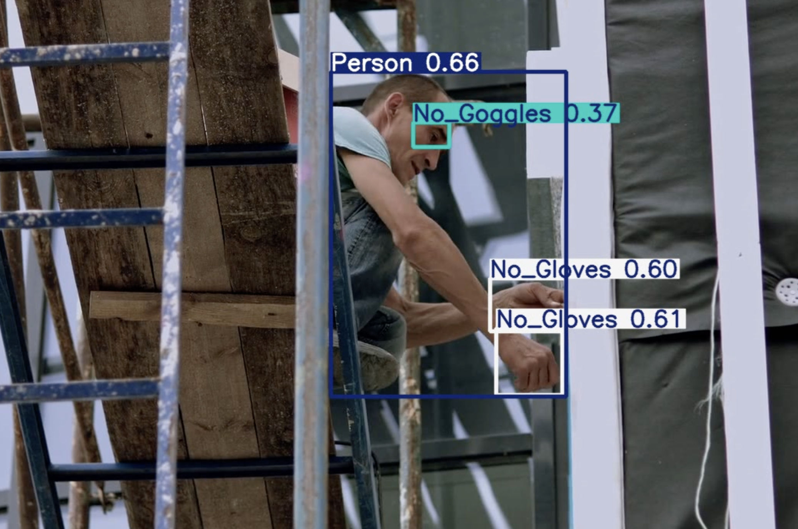
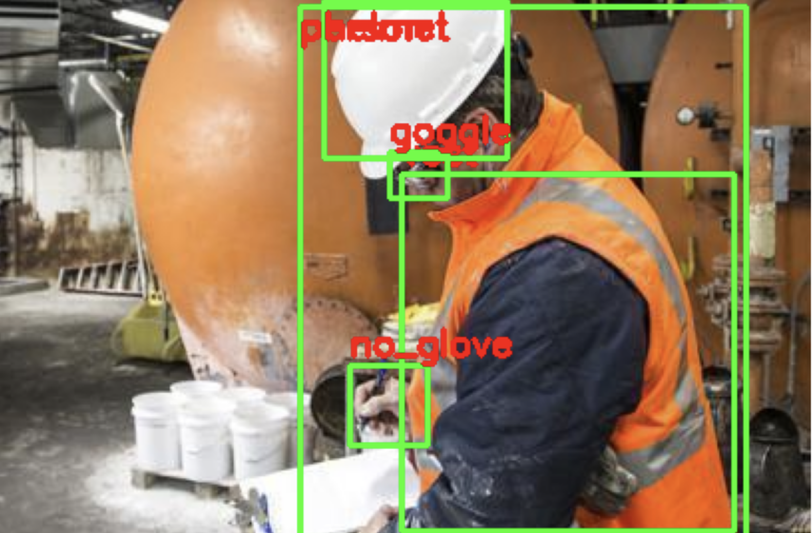
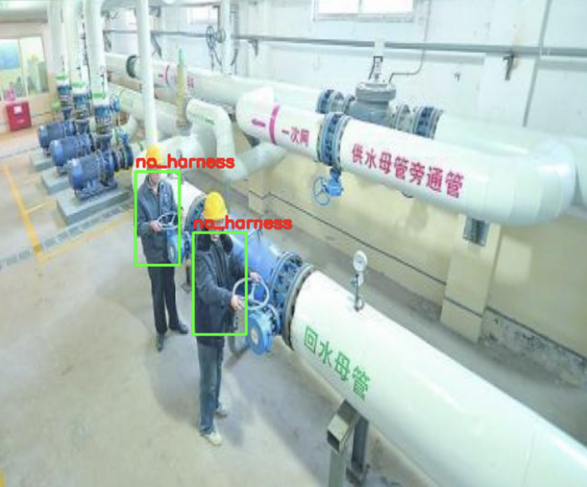
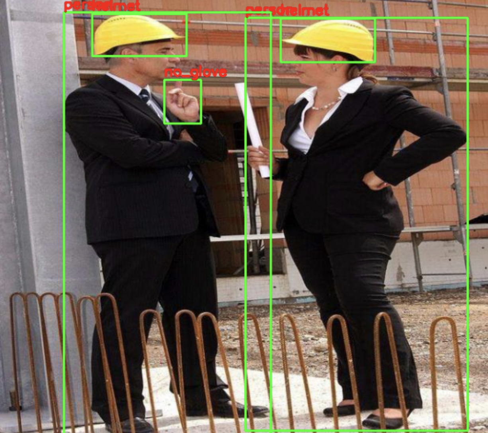

# 🦺 PPE Compliance Detection System using YOLOv8

## Overview

This project presents a deep learning-based Personal Protective Equipment (PPE) Compliance Detection System designed for industrial and construction-site safety monitoring. The system leverages state-of-the-art object detection techniques to automatically identify workers and verify compliance with mandatory safety equipment requirements in real time.

The model detects both PPE presence and safety violations, enabling automated workplace monitoring, hazard prevention, and compliance auditing in high-risk environments such as construction sites, manufacturing facilities, and oil & gas operations.

---

## Key Features

✅ Real-time PPE compliance monitoring

✅ Detection of safety violations

✅ Multi-class object detection using YOLOv8

✅ ONNX export support for deployment

✅ Optimized for industrial and construction environments

### Supported Classes

| Class |
|---------|
| Helmet |
| No Helmet |
| Goggle |
| No Goggle |
| Glove |
| No Glove |
| Harness |
| No Harness |
| Vest |
| No Vest |
| Person |

---

## Dataset

The model was trained on a consolidated dataset containing 40,000+ annotated construction-site images collected from multiple publicly available sources.

### Dataset Engineering

- Data cleaning and preprocessing
- Class remapping and standardization
- Annotation validation
- Dataset merging from multiple sources
- Removal of redundant and inconsistent labels

The final dataset was curated to support robust learning across diverse workplace conditions, camera angles, worker poses, and environmental settings.

---

## Model Architecture

This project uses YOLOv8 for object detection and transfer learning.

### Training Pipeline

1. Dataset Collection & Annotation
2. Data Cleaning & Standardization
3. Transfer Learning using YOLOv8
4. Hyperparameter Optimization
5. Evaluation & Validation
6. ONNX Export for Deployment

---

# Model Performance

Detailed training metrics are available here:

[Training Metrics](docs/training_metrics.md)

### Performance Summary

Dataset Size: 40,000+ annotated images

| Metric | Value |
|----------|----------|
| Precision | 72.4% |
| Recall | 75.2% |
| mAP@50 | 77.9% |
| mAP@50-95 | 53.3% |

### Best Performing Classes

| Class | mAP@50 |
|---------|---------|
| Harness | 97.9% |
| Vest | 92.8% |
| No Helmet | 89.8% |
| Helmet | 88.5% |
| Person | 88.1% |

Classes:
- helmet
- no_helmet
- goggle
- no_goggle
- glove
- no_glove
- harness
- no_harness
- vest
- no_vest
- person

---

## Technology Stack

### Programming Language

- Python

### Machine Learning & Computer Vision

- YOLOv8
- Computer Vision
- Deep Learning
- Object Detection
- Transfer Learning

### Libraries & Frameworks

- OpenCV
- NumPy
- Pandas
- Matplotlib

### Tools

- Roboflow
- Google Colab
- Git
- GitHub

### Deployment

- ONNX

---
## Sample Results

### PPE Compliance Detection

The following examples demonstrate the model's ability to detect PPE compliance and safety violations in industrial and construction-site environments.

#### Example 1

#### Example 2

#### Example 3

#### Example 4

---

## Applications

- Construction Site Safety Monitoring
- Industrial Safety Compliance
- Oil & Gas Operations
- Automated Workplace Auditing
- Workforce Safety Analytics
- Smart Surveillance Systems

---

## Future Improvements

- PPE violation alert generation
- Real-time video stream monitoring
- Worker tracking and identification
- Multi-camera deployment
- Safety compliance dashboards
- Edge-device deployment optimization

---

## Author

Sana Goel

Developed as part of industrial safety monitoring initiatives focusing on AI-driven workplace safety and compliance automation.
